<div align="center">
    
</div>

## <div align="center"> YaYa-SaaS-Plus极简SaaS系统 </div>
<div align="center">
	<a href="https://gitee.com/ukoko/ya-ya-saa-s-plus"></a>
    <a href="https://gitee.com/ukoko/ya-ya-saa-s-plus">=v4.0.6-orange"></a>
    <a href="https://gitee.com/ukoko/ya-ya-saa-s-plus"></a>
    <a href="https://gitee.com/ukoko/ya-ya-saa-s-plus">=v8.0-gold"></a>
    <a href="https://gitee.com/ukoko/ya-ya-saa-s-plus">=v3.0.5-brown"></a>
	<a href="https://gitee.com/ukoko/ya-ya-saa-s-plus"></a>
</div>

---

## 一、介绍
`YaYa-SaaS-Plus`一款适合中小企业开源SaaS系统,系统精简(保留SaaS最小单元),用户操作方便,利于企业维护和扩展.<br>
🌟后端采用 [SpringBoot4.x](https://spring.io/) 版本构建<br>
🌟前端采用 [YaYa-LayUI-Admin-Plus](https://gitee.com/ukoko/yaya-layui-admin-plus) 模板构建


```
分支(mastetr) : SaaS系统的基础分支
分支(yaya-rag): 知识库系统分支
```

---
## 二、优势
```
1. 适合新手开发和使用(前端新手 ➕ 后端新手)
2. 持续的成本控制(开发成本极低 ➕ 维护成本极低)
3. 基于MIT开源协议(协议宽泛 ➕ 友好)
4. 功能强大(丰富的工具类 ➕ 核心功能)
```
---
## 三、系统演示
```
预览地址: http://106.14.27.178/
账号/密码: 
    超级管理员 root/123456
    系统管理员 admin/123456
    运营管理员 operation/123456
```
---
## 四、页面预览

<table>
<tr>
<td colspan="2">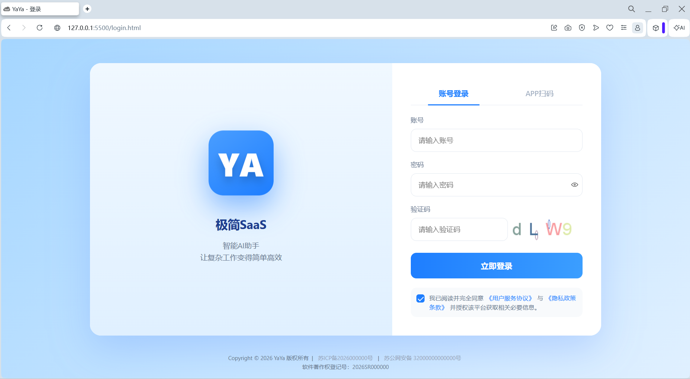</td>
<td colspan="2">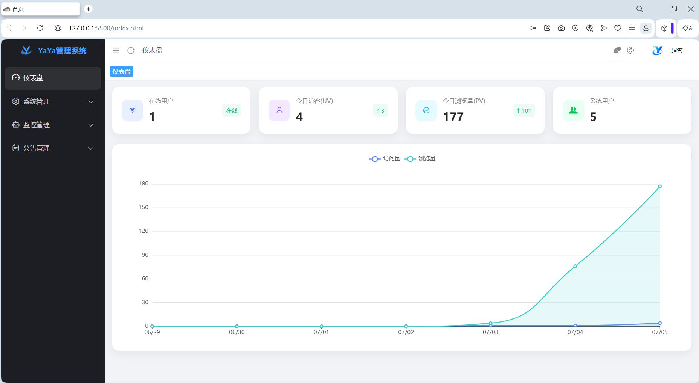</td>
</tr>
<tr>
<td colspan="2">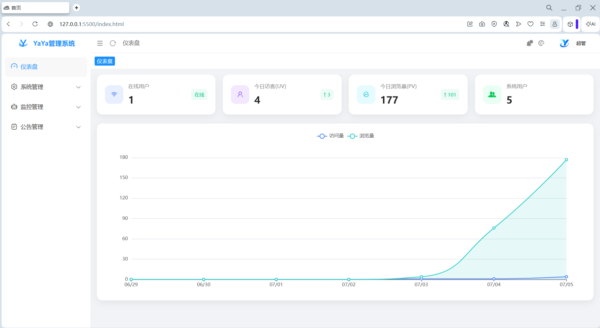</td>
<td colspan="2">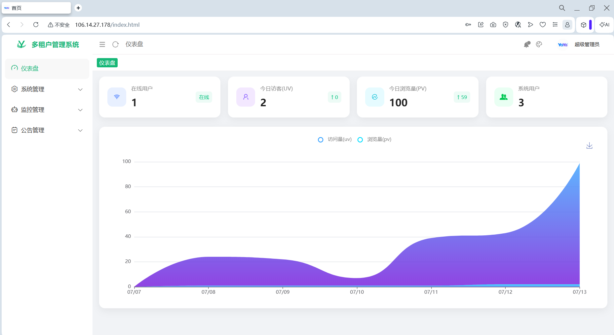</td>
</tr>
<tr>
<td colspan="2">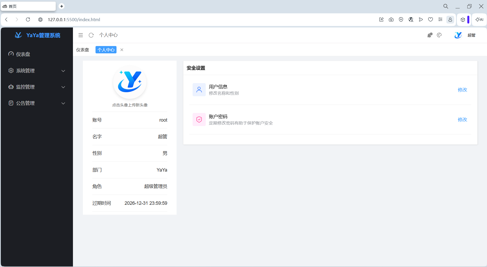</td>
<td colspan="2">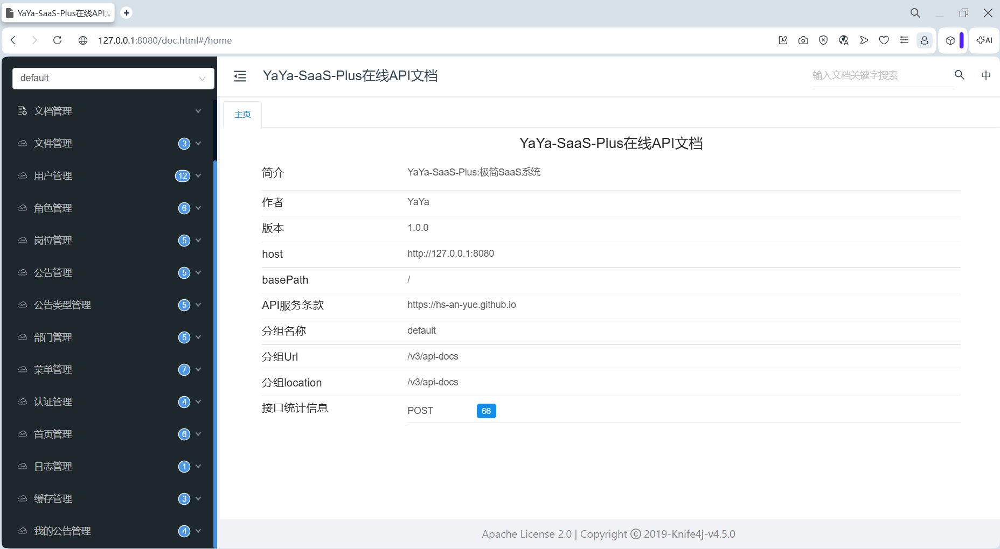</td>
</tr>
<tr>
<td>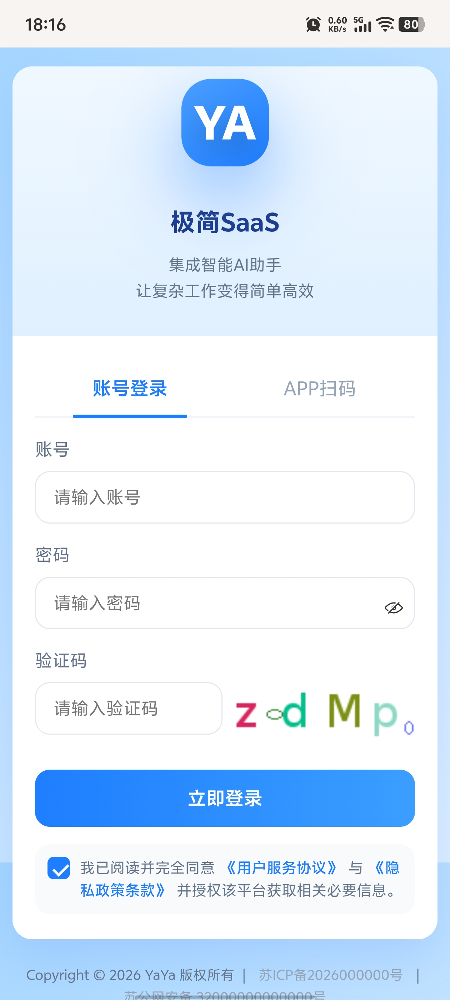</td>
<td></td>
<td>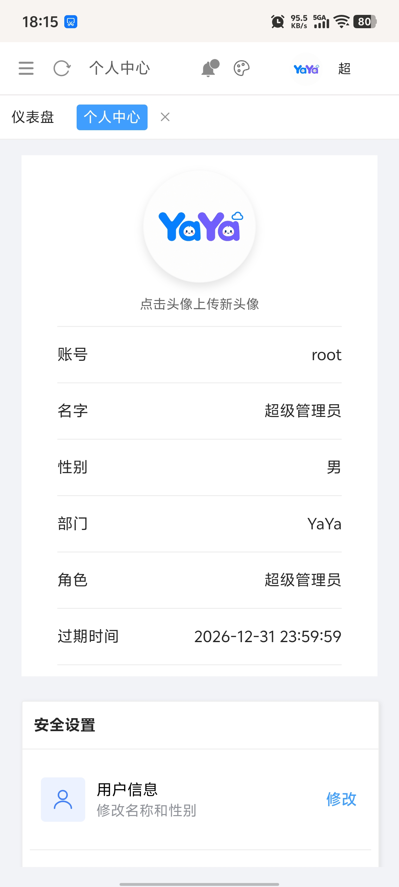</td>
<td>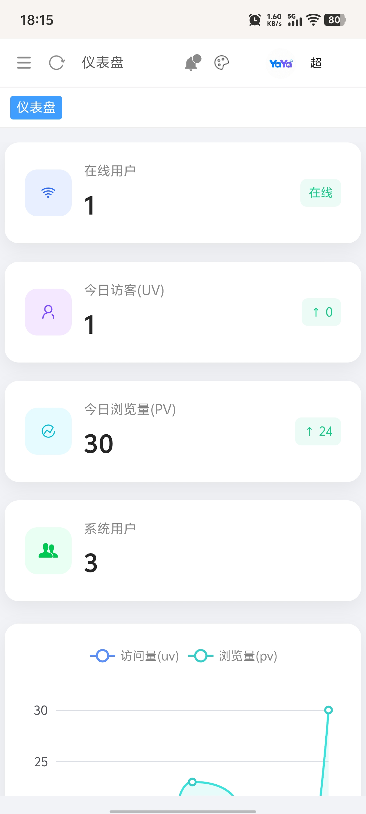</td>
</tr>
</table>

```
注意⚠️:
    1. 如果通过移动端浏览器访问SaaS管理系统，没有几个页面是可以真正完全支持响应式布局的.
    2. 对于管理系统而言，响应式布局意义不大，因为管理系统如果非要在移动端使用，会开发专门的移动端APP.
```

---

## 四、系统权限介绍
```
YaYa平台默认权限体系介绍:
1. 自带默认部门1个    -- 不能删除，用来放默认用户
2. 自带默认角色3个    -- 不能删除，给默认用户分配角色
3. 自带默认用户3个    -- 不能删除，用来进行平台的基本管理

账户1: 超级管理员账号，不需要分配任何权限，这个账号本身权限就是整个平台最高的，平时基本不用，一般在平台出现菜单权限和数据权限混乱时用此账号进行权限梳理。
账户2: 系统管理员账号，开发人员使用，权限由超级管理员账号分配，按需要分配即可。
账号3: 运营管理员账号，给公司运营人员使用，主要用于平台上租户的管理(包括租户管理账号的管理，套餐管理等)
```
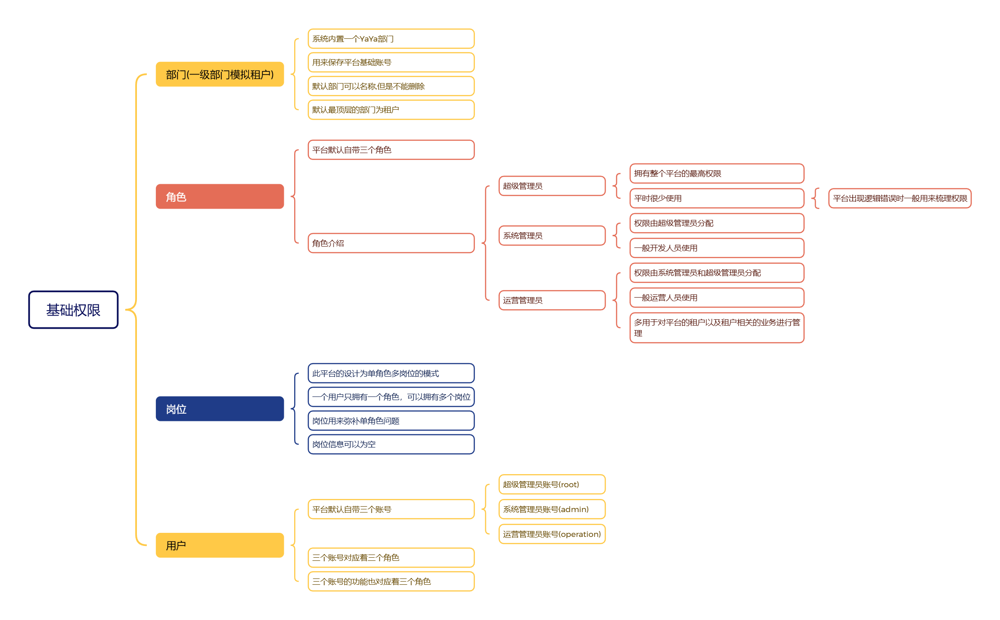

## 五、技术架构介绍

### 1. 技术介绍
#### 1.1 前端技术栈

<table>
<tr>
<th>框架</th>
<th>版本</th>
<th>官网</th>
<th>备注</th>
</tr>
<tr>
<td>Layui</td>
<td>2.13.8</td>
<td>https://layui.dev/</td>
<td>基于原生HTML/CSS/JS(JQuery)开发</td>
</tr>
<tr>
<td>
yaya-layui-admin-plus
</td>
<td>2.2.1</td>
<td>https://gitee.com/ukoko/yaya-layui-admin-plus</td>
<td>基于Layui实现</td>
</tr>
<tr>
<td>
xm-select
</td>
<td>1.2.4</td>
<td>https://xm-select.com/file/xm-select/v1.2.4/#/component/install</td>
<td>始于Layui实现,可独立使用</td>
</tr>
</table>

---

#### 1.2 后端技术栈

<table>
<tr>
<th>框架</th>
<th>版本</th>
<th>官网</th>
<th>备注</th>
</tr>
<tr>
<td>SpringBoot</td>
<td>4.0.6</td>
<td>https://spring.io/</td>
<td>项目底座</td>
</tr>
<tr>
<td>mybatis-plus</td>
<td>3.5.15</td>
<td>https://baomidou.com/</td>
<td>持久层框架</td>
</tr>
<tr>
<td>knife4j</td>
<td>4.5.0</td>
<td>https://doc.xiaominfo.com/</td>
<td>在线文档增强</td>
</tr>
<tr>
<td>jwt</td>
<td>4.4.0</td>
<td>https://www.jwt.io/</td>
<td>token令牌工具</td>
</tr>
<tr>
<td>jthinking</td>
<td>2.1.7</td>
<td>https://gitee.com/jthinking/ip-info</td>
<td>IP地址解析工具</td>
</tr>
<tr>
<td>thumbnailator</td>
<td>0.4.21</td>
<td>https://github.com/coobird/thumbnailator</td>
<td>图片压缩工具</td>
</tr>
<tr>
<td>bouncycastle</td>
<td>1.84</td>
<td>https://www.bouncycastle.org/</td>
<td>算法库</td>
</tr>
</table>

#### 1.3 数据库
```
关系型: MySQL8.4+
非关系型: Redis3.5+
```
### 2. 架构介绍
#### 2.1 前端技术架构

前端基于[YaYa-Layui-Admin-Plus](https://gitee.com/ukoko/yaya-layui-admin-plus)模板实现，此模板基于[LayUI](https://layui.dev/)框架实现，纯原生开发，用户只需要掌握基础的html/css/js(jQuery)即可完成开发,开发成本极低，项目采用多页面独立开发模式，页面和页面之间基本没有业务关联，相互独立，在多用户协同开发时可以降低交叉，降低因为程序员习惯差异较大，对整个项目造成的影响，可以很好的降低后期的运维成本。

---

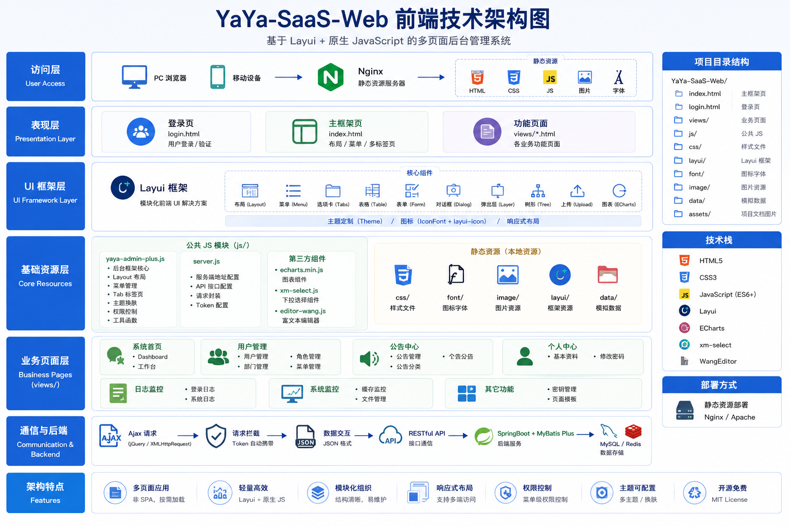

#### 2.2 后端技术架构

基于SpringBoot4.x生态开发，使用简单，框架生态强大，社区兼容性强，Java相关技术都会与之适配，与AI相关的生态兼容性好.

---

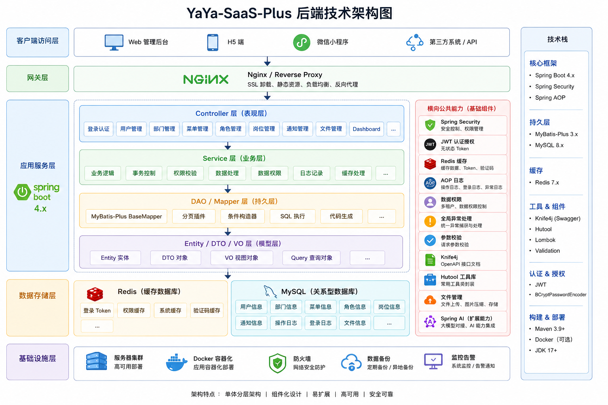

### 3. 架构优缺点介绍

```
前端:
    优点: 入门门槛极低,开发简单,运维简单,开发成本极低,运维成本极低
    缺点: 针对PC端基本上没有缺点，可能唯一的缺点就是响应式需要自己实现，但是针对PC端响应式不重要
后管:
    优点:
        1. 单module设计，项目架构简单，方便新手程序员开发和运维
        2. 前后端分离架构设计，针对后端设计可以单点部署，也可以集群部署，不需要做任何修改
        3. 基于目前最新的SpringBoot4.x框架，面对发展迅速的AI可以很好的兼容和升级
        4. 项目在设计时，考虑到了开发和运维成本的问题，在设计上提供了很多，简单高效的功能和工具类，例如:
            4.1 统一日志收集系统(目前只收集增删改的功能日志)，如果想收集查询，只需要在控制器层的方法上添加注解(@LogCollect)即可
            4.2 统一异常收集系统，异常会通过统一日志收集系统，收集到数据库中保存(要定期删库,否则数据会爆炸)，还有另一种文件形式以.log文件保存到本地。
            4.3 前端重复提交,或者频繁针对同一个功能的点击，添加了灵活在控制方式(基于注解@RepeatSubmit)
            4.4 以及一些非常常用的工具类等
    缺点:
        1. 项目如果做大，开发时会出现开发工具卡顿，启动较慢
        2. 单个项目中文件过多，针对开发和维护人员来说，视角不是很好
        3. 单点项目通病,项目过大，开发文件过多，协同时版本冲突等问题

注意⚠️: 以上的缺点在成本(开发成本+运行成本+时间成本)面前都不算严重的缺点.                
```

## 六、基础模块介绍

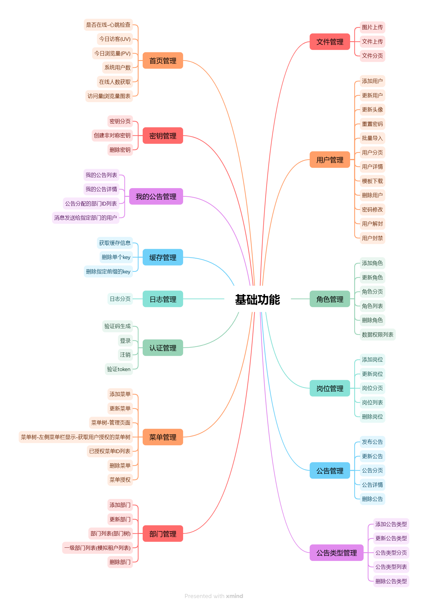

## 七、代码审查
```
对于针对政企的项目,需要做代码安全审查
```
### 代码审查

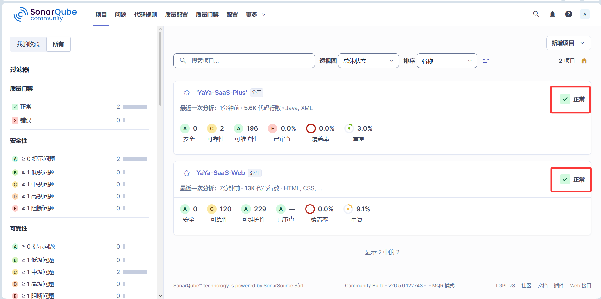

## 八、开发环境搭建

### 1. 开发工具
```
后端: IntelliJ IDEA (IDEA)
前端: Visual Studio Code (VS Code)
```
### 2. 项目导入和运行
### 2.1 项目地址
```
https://gitee.com/ukoko/ya-ya-saa-s-plus

前后端项目在同一个仓库中
```

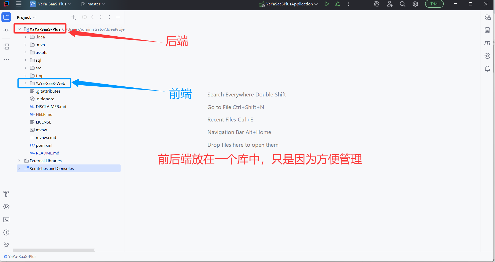

### 2.2 项目导入
> Java项目导入到IDEA中
> 前端项目导入到VS Code中

<table>
<tr>
<td> 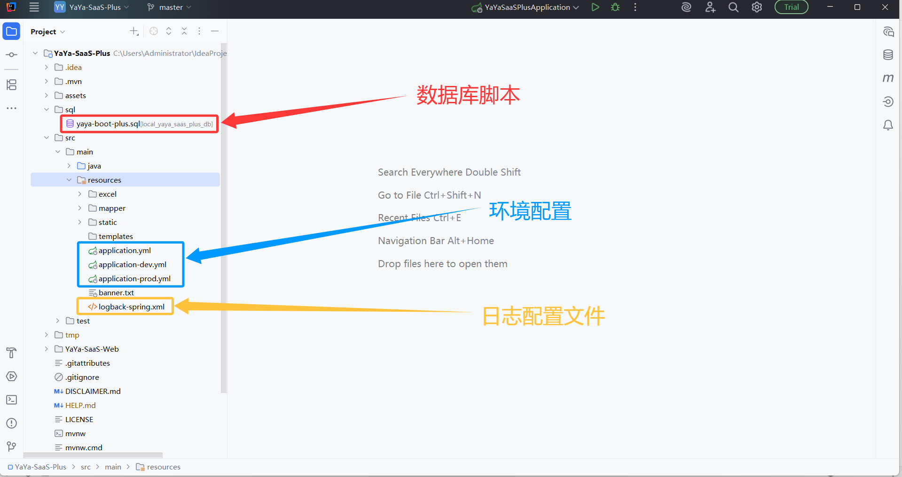 </td>
<td> 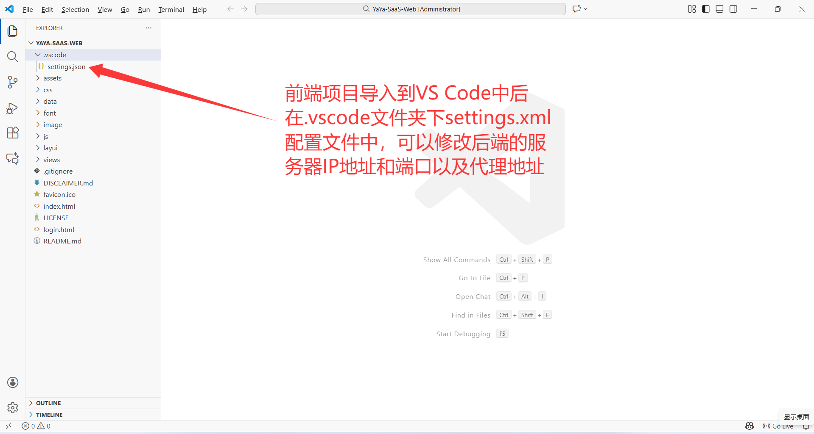 </td>
</tr>
</table>

### 2.3 数据库创建和导入
```
略
```

---

## 九、参与贡献🚀

```
前后端由作者一个人+AI工具完成
作者博客: https://hs-an-yue.github.io/
作者邮箱: hd1611756908@163.com
```

## 十、致谢💖
感谢 LayUI、Echarts、xm-select、jQuery 等前端跨框架支持;以及 Gemini、Grok、ChatGPT、豆包、千问 等模型的支持。