## YaYa-SaaS-Plus使用手册

### 新租户入住
```
YaYa-SaaS-Plus系统适合中小企业,采用顶层部门模拟租户的方式,所以一级部门既是部门也是租户
```
#### 新建租户(新建部门)
```
租户入住需要使用平台权限(超管|系统管|运营管)
一级部门创建完成后，用户就有了租户,如果没有二级以及三级部门,那么一级部门就既是租户也是部门.
如果存在二级三级部门,那么只有一级部门可以称之为租户.
```

<table>
<tr>
<td>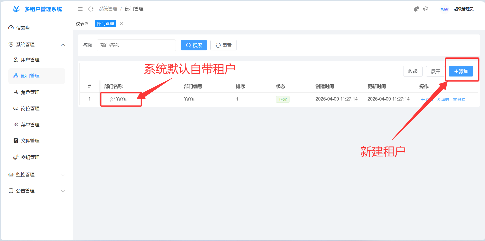</td>
<td>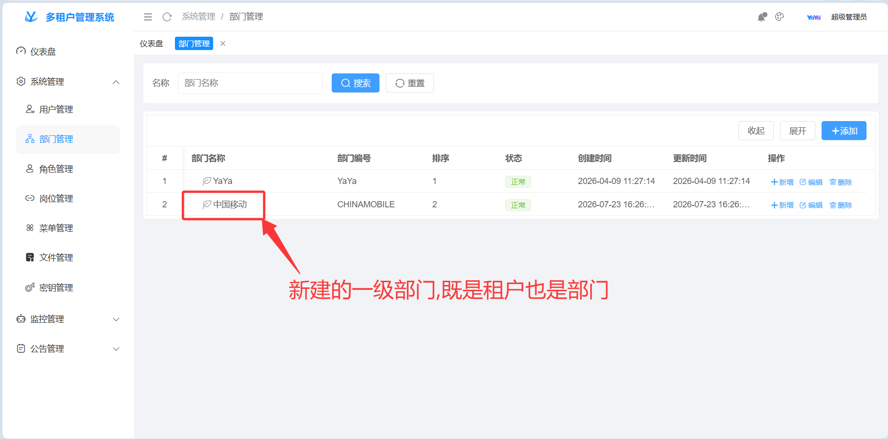</td>
</tr>
<tr>
<td>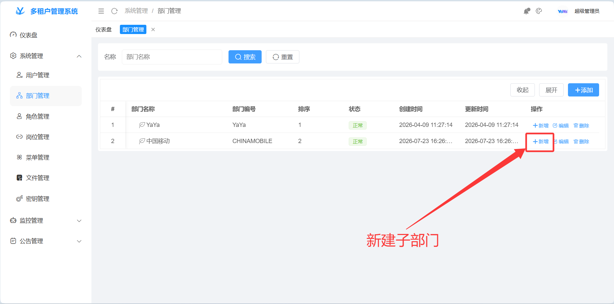</td>
<td>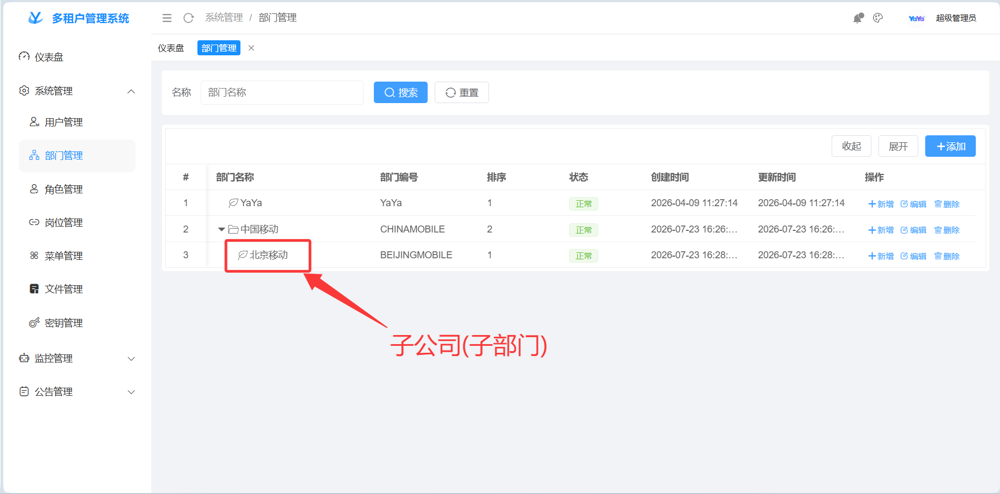</td>
</tr>
<tr>
<td>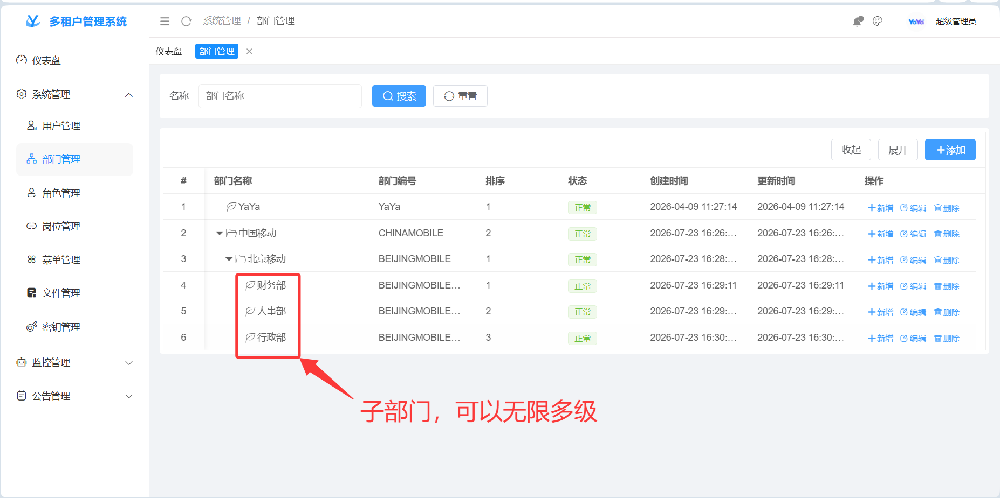</td>
</tr>
</table>

---
#### 新建角色
```
角色是整个SaaS系统的关键,用户的一些功能(菜单权限+数据权限)都挂在角色上
给当前租户创建所属角色
```
<table>
<tr>
<td>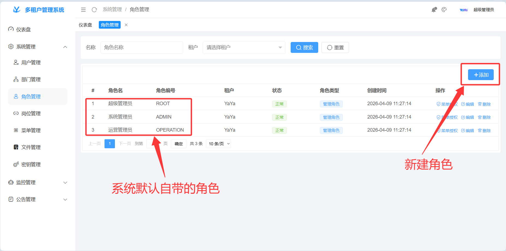</td>
<td>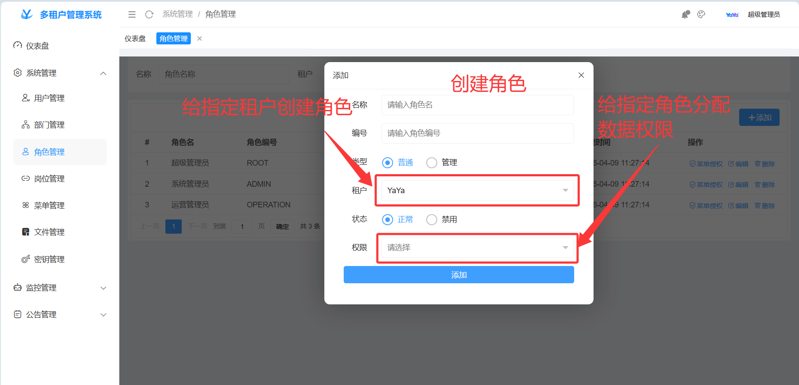</td>
</tr>
<tr>
<td>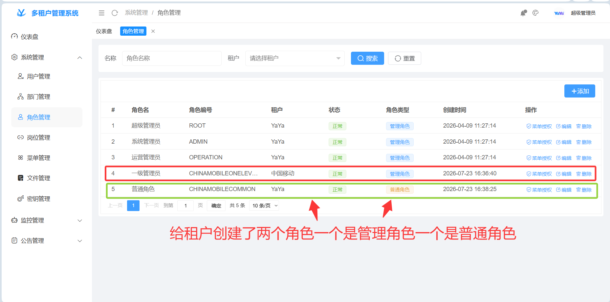</td>
<td>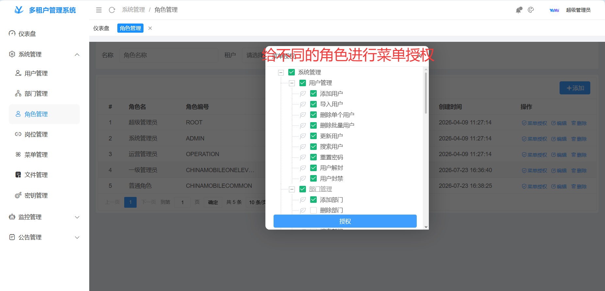</td>
</tr>
</table>

#### 新建岗位
```
当前系统是单角色-多岗位的设计，岗位不是必须的。
给当前租户创建所属岗位
```
<table>
<tr>
<td>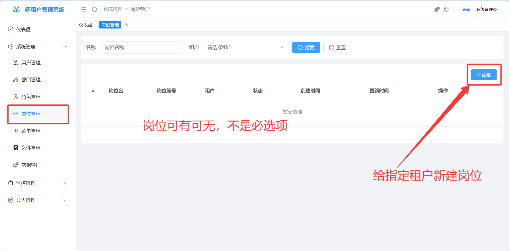</td>
<td>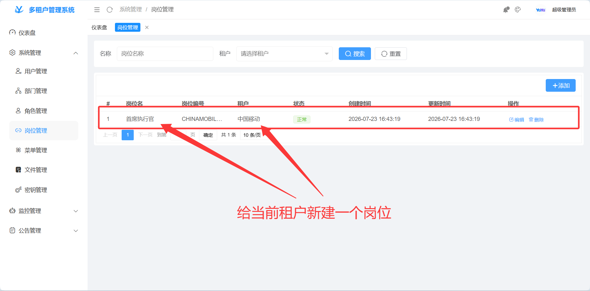</td>
</tr>
</table>

#### 新建用户
```
对于新租户来说新建用户分为两步
第一步: 由平台管理员给新的租户中添加管理员账户，用来对租户的业务数据进行管理
第二步: 第一步完成后,租户中除了管理之外的其他非管理用户需要由第一步新建的租户管理员进行自己用户的管理

新增用户分为两种方式: 
方式一: 直接添加
方式二: 文件导入(文件导入只能导入非管理账户)
```

<table>
<tr>
<td>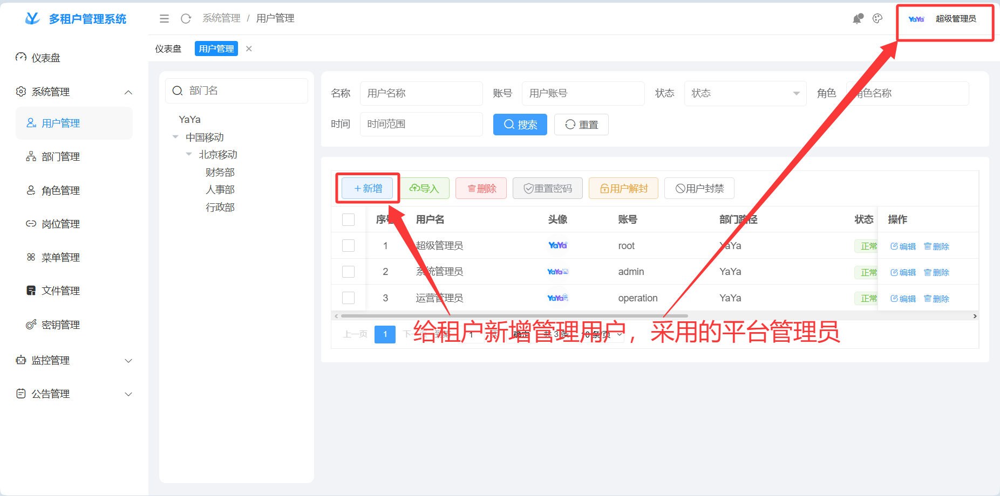</td>
<td>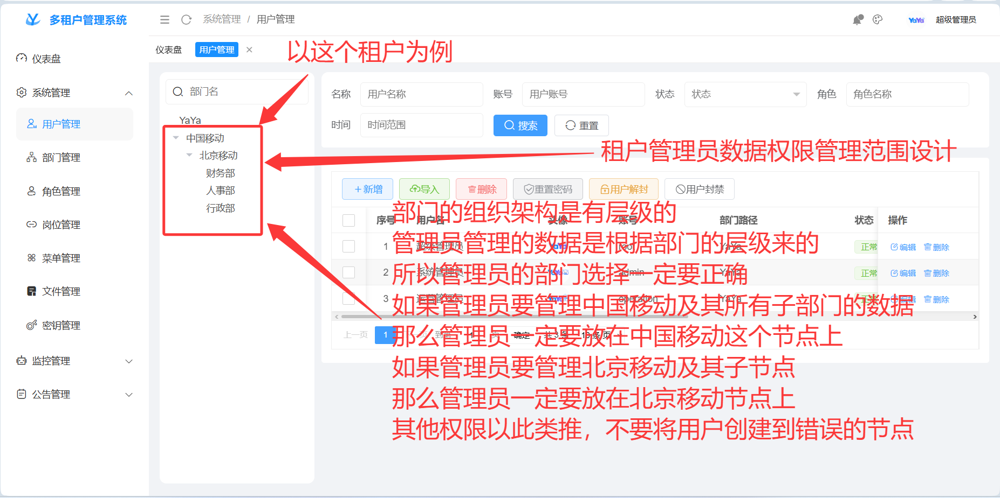</td>
</tr>
<tr>
<td>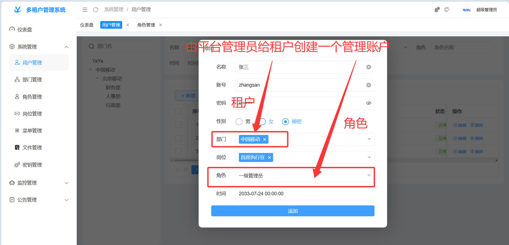</td>
<td>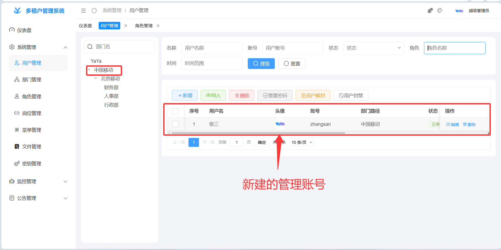</td>
</tr>
</table>

> 租户的管理账号创建成功后,需要给当前管理账号进行菜单授权(分配功能)

<table>
<tr>
<td>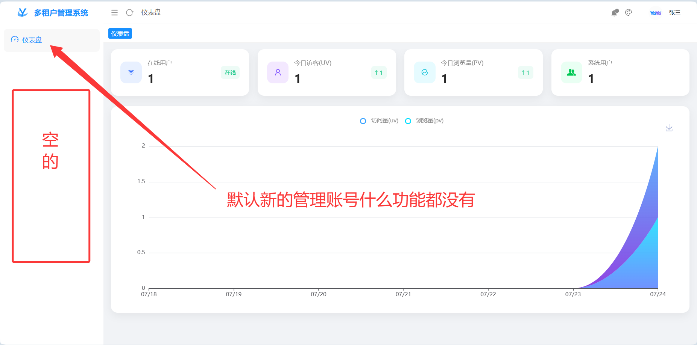</td>
<td>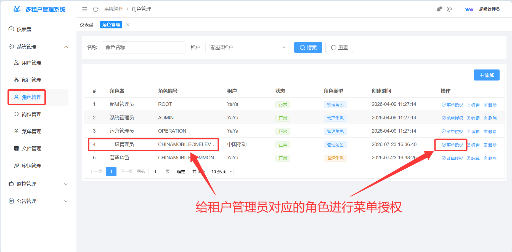</td>
</tr>
<tr>
<td>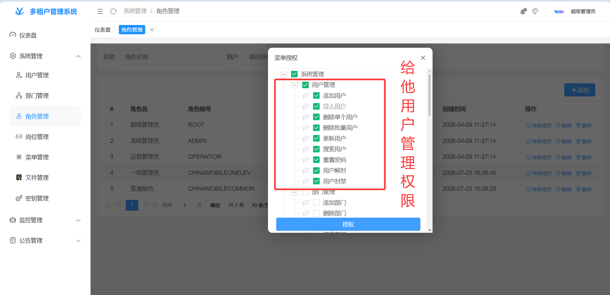</td>
<td>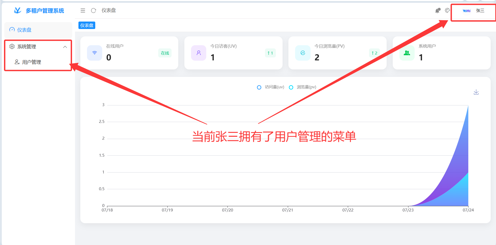</td>
</tr>
<tr>
<td>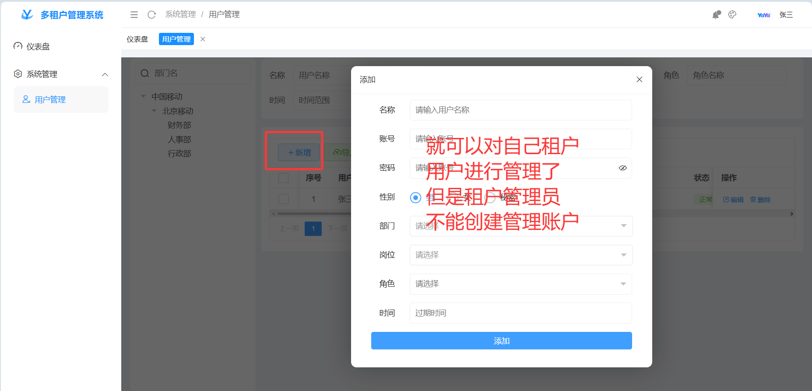</td>
<td>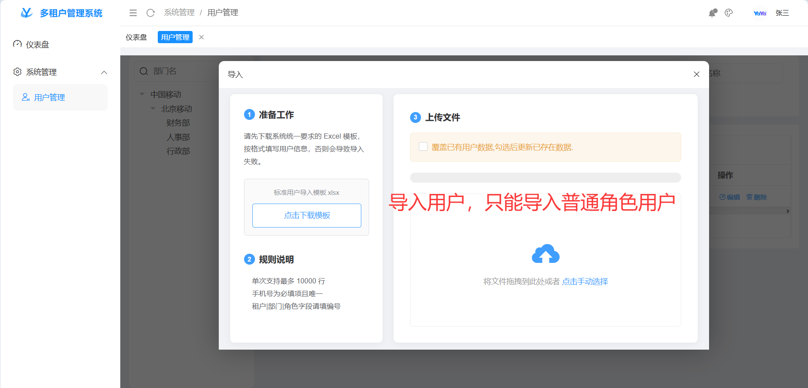</td>
</tr>
</table>

---

> 以上为租户入住的基本流程