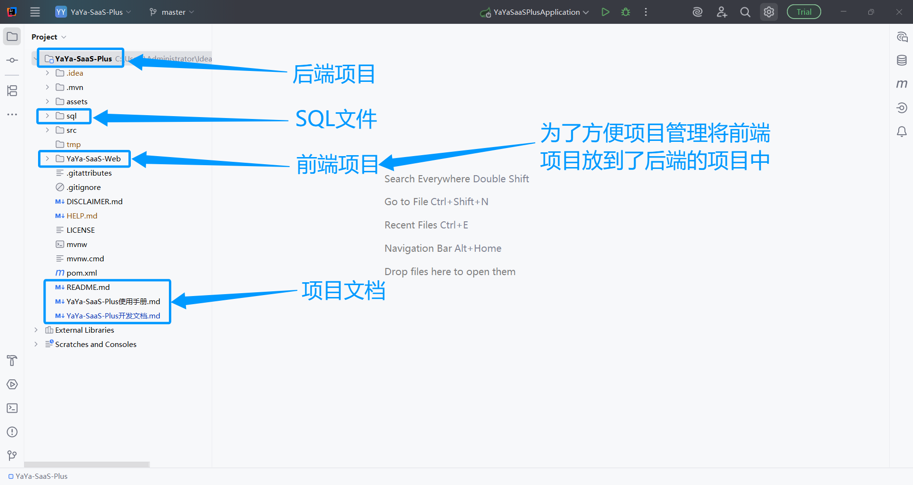

## 开发文档

### 一、项目结构



---
#### 1. 前端项目结构

```
# YaYa-SaaS-Web
├─ 📂 .vscode
│  └─ settings.json 开发时使用,配置web服务代理
├─ 📂 css           CSS样式文件
├─ 📂 font          字体相关文件,包括字体图标
├─ 📂 image         项目中用到的一些图片和图标
├─ 📂 js            JS文件
├─ 📂 layui         Layui框架库
├─ 📂 views         业务相关的核心页面
├─ favicon.ico      浏览器选项卡图标
├─ index.html       项目首页
└─ login.html       项目登录页
```

#### 2. 后端项目结构

```
# YaYa-SaaS-Plus
├─ 📂 sql                                            项目的SQL文件
├─ 📂 src                                            后端项目的核心代码
│  └─ 📂 main                                        核心文件
│     └─ 📂 java                                     核心代码
│        └─ 📂 com.yaya 
│           └─ 📂 annotation                         注解 
│              └─ DataPermission                     数据权限注解
│              └─ LogCollect                         日志收集注解
│              └─ RepeatSubmit                       重复提交注解
│           └─ 📂 aop                                切面 
│              └─ LogAspect                          日志收集切面
│              └─ RepeatSubmitAspect                 重复提交切面
│           └─ 📂 config                             配置 
│              └─ Knife4jConfig                      knif4j在线API文档配置
│              └─ MybatisPlusConfig                  mybatis-plus配置
│              └─ YaYaConfig                         YaYa-SaaS-Plus项目自定义配置
│           └─ 📂 controller                         控制器 
│           └─ 📂 entity                             映射数据库表的实体类 
│           └─ 📂 exception                          自定义异常 
│              └─ GlobalCommonException              自定义异常
│           └─ 📂 filter                             过滤器 
│              └─ TrackIdFilter                      自定义过滤器,设计日志链路ID
│           └─ 📂 handler                            处理器 
│              └─ GlobalExceptionHandler             统一异常收集器
│           └─ 📂 interceptor                        拦截器 
│              └─ YaYaDataPermissionInterceptor      数据权限实现拦截器
│           └─ 📂 mapper                             操作数据库表的接口类 
│           └─ 📂 model                              业务实现过程是封装进行数据库传递的模型类
│           └─ 📂 security                           SpringSecurity相关配置 
│           └─ 📂 service                            业务逻辑层 
│           └─ 📂 util                               工具类 
├─ └─ └─ 📂 resources                                核心配置
├─ └─ 📂 test                                        测试代码
│     └─ 📂 java                                     代码目录
├─ pom.xml                                           依赖
└─ readme.md
```

### 数据权限规范
```
数据权限包含:
1. 全部数据
2. 当前部门及其子部门数据
3. 当前部门数据
4. 本人数据
5. 指定部门数据

那他的数据权限是怎么实现的呢？

其实很简单，假如有一张表叫 t1,具体描述如下:

CREATE TABLE `t1` (
    `id`           BIGINT  PRIMARY KEY  AUTO_INCREMENT      COMMENT '主键ID',
    `name`         VARCHAR(255)         NOT NULL            COMMENT '名称',
    `create_id`    BIGINT               NOT NULL            COMMENT '创建人ID',
    `dept_id`      BIGINT               NOT NULL            COMMENT '创建人部门ID'
) ENGINE=InnoDB DEFAULT CHARACTER SET=utf8mb4 COMMENT='文件管理表';

//获取全部数据
SELECT * FROM t1

//本人数据,比如我的用户ID为1
SELECT * FROM t1 WHERE create_id=1 //创建人ID为1的数据

//当前部门的数据,比如我的部门为1
SELECT * FROM t1 WHERE dept_id=1 //创建人部门ID为1的数据

//指定部门数据,比如查询部门ID为1和2的数据
SELECT * FROM t1 WHERE dept_id IN(1,2)

//当前部门及其子部门数据
SELECT * FROM t1 WHERE dept_id IN(1,2,3,4) 部门及其子部门ID
```
> 数据权限的核心是数据库表在设计时一定要有create_id(列名自定义)和dept_id(列名自定义)两个列,列名根据实际需求自定义即可。

### 数据库表设计规范

> 为了实现权限管理,只要涉及到数据权限的表,都必须添加create_id(列名自定义)和dept_id(列名自定义)两个列

### 日志记录设计

```
日志设计是基于AOP实现的
1. 日志记录表 sys_log

2. 日志收集AOP类
com.yaya.aop.LogAspect

3. 日志收集注解-要收集哪个具体功能的方法,就在当前方法上添加注解
com.yaya.annotation.LogCollect

想记录哪个功能的日志，需要在指定的控制器方法上添加此注解即可.示例如下:

@LogCollect(module = "认证管理-验证token",logResponse = true) //收集日志的注解,添加后日志会被保存到sys_log表中
@Operation(summary = "验证token")
@PostMapping(value = "/checkToken")
public Result<Object> checkToken(){
    return Result.ok();
}
```

### 防重提交设计
```
防止接口被重复调用,基于AOP实现

1. 防重复调用AOP类
com.yaya.aop.RepeatSubmitAspect

2. 防重复调用注解
com.yaya.annotation.RepeatSubmit

示例如下:
@Operation(summary = "验证码生成")
@LogCollect(module = "认证管理-验证码生成")
@RepeatSubmit(expireTime = 1,message = "验证码生成的太频繁") //重复获取会提示
@PostMapping(value = "/captchaImage")
public Result<Map<String,Object>> captchaImage() throws IOException {
    return Result.ok(authService.captchaImage());
}
```

### 统一异常规范

```
统一异常处理,方便的收集系统的异常消息

1. 自定义全局异常类
com.yaya.exception.GlobalCommonException

2. 自定义异常收集处理器
com.yaya.handler.GlobalExceptionHandler

```

### 日志链路生成规范

```
为了更好的进行日志管理,给输出的日志添加了一个链路ID,基于过滤器实现

1. 过滤器
com.yaya.filter.TrackIdFilter

2. 在日志配置文件中配置
resources\logback-spring.xml
```

### 账户密码约束工具
```
com.yaya.util.AccountAndPassWordMatchUtils

校验账号密码是否合法,如果要修改规则,修改这个类即可
```

### 数据加密工具
```
com.yaya.util.CryptoUtils
1. 密钥生成
2. 非对称加密
3. Base64编码解码

如果要修改或者扩展在此类中进行
```

### 数据脱敏工具
```
com.yaya.util.DesensitizeUtils

1. 手机号脱敏
2. 身份证号脱敏
3. 邮箱脱敏
4. IP地址脱敏
如果有需要进行脱敏工具扩展在此类中进行
```

### Token管理工具
```
com.yaya.util.JwtUtils

token的创建教研以及信息获取
```
### 图片压缩工具
```
com.yaya.util.ImageCompressUtils

如果设计图片压缩在此类中扩展
```

### 缓存客户端工具
```
com.yaya.util.RedisClient

redis操作的相关封装,如果扩展在这里
```

### SpringSecurity权限配置
```
com.yaya.security.SecurityConfig

SpringSecurity的白名单等权限配置在这里
```

### SpringSecurity在线用户信息获取工具
```
com.yaya.util.SecurityUtils

用户登录后,获取用户登录信息可以在这里扩展
```
